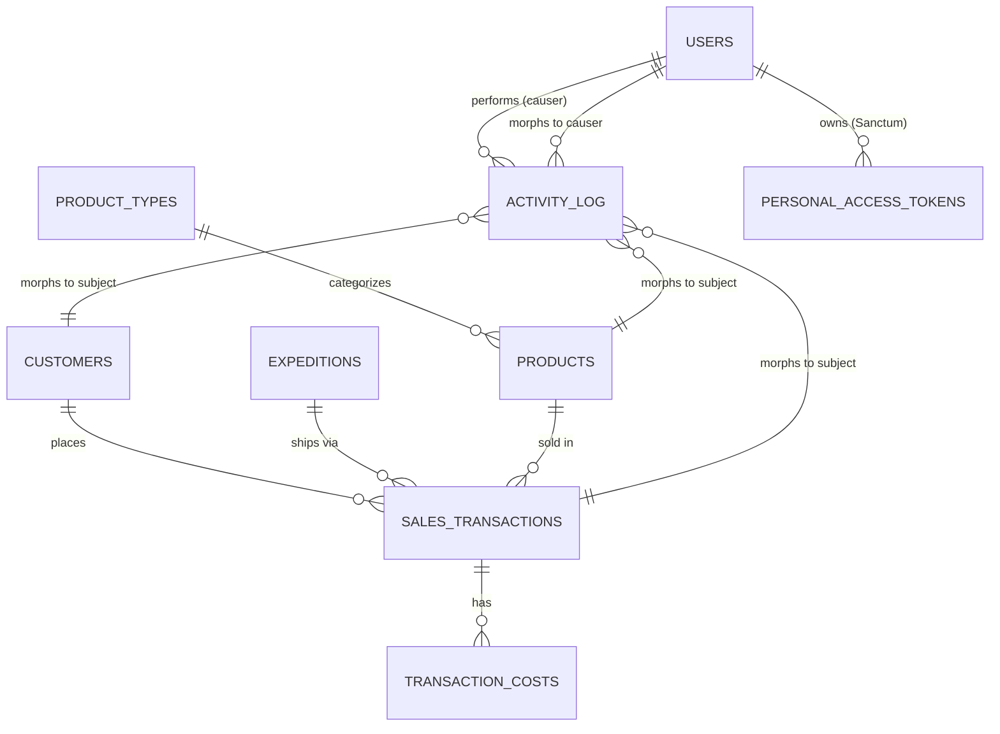

# ERD & Database Documentation — PT TRS Backend

Dokumentasi struktur database dan relasi antar tabel untuk sistem informasi keuangan PT Trisena Rekainova Sinergi.

---

## 📊 Entity Relationship Diagram



**Legend cardinality:**
- `||--o{` = one-to-many (parent satu, child banyak)
- `}o--||` = many-to-one polymorphic (activity_log bisa relasi ke MANY model lewat subject_type)

---

## 📑 Daftar Tabel

| Tabel | Tujuan | Migrated by |
|-------|--------|-------------|
| `users` | Akun login (owner/finance) | Laravel default + custom (role) |
| `personal_access_tokens` | Token Sanctum untuk API auth | Sanctum |
| `customers` | Master customer | Custom |
| `expeditions` | Master kurir pengiriman | Custom |
| `product_types` | Master kategori produk | Custom |
| `products` | Master produk + harga | Custom |
| `sales_transactions` | Catatan transaksi penjualan utama | Custom |
| `transaction_costs` | Detail biaya operasional per transaksi (shipping, packaging) | Custom |
| `activity_log` | Audit trail (siapa, kapan, ubah apa) | Spatie Activity Log |
| `cache`, `jobs`, dst | Default Laravel system | Laravel default |

---

## 🗂️ Per-Table Detail

### 1. `users`

| Kolom | Tipe | Constraint | Notes |
|-------|------|------------|-------|
| `id` | bigint | PK | |
| `name` | varchar(255) | required | |
| `email` | varchar(255) | unique, required | login identifier |
| `password` | varchar(255) | required | bcrypt hashed |
| `role` | varchar | required, default 'finance' | enum: `owner` \| `finance` |
| `email_verified_at` | timestamp | nullable | Laravel default (tidak dipakai aktif) |
| `remember_token` | varchar | nullable | Laravel default |
| `created_at`, `updated_at` | timestamps | | |

**Relasi:**
- `hasMany` → `personal_access_tokens` (Sanctum tokens)
- `morphMany` (polymorphic) → `activity_log` sebagai **causer** (user yang melakukan action)

**Activity Log:** track `name`, `email`, `role` saat perubahan. Password TIDAK di-log (sensitive).

---

### 2. `customers`

Master data customer. Diisi manual oleh finance/owner. Future: integrasi e-commerce auto-create dari order.

| Kolom | Tipe | Constraint | Notes |
|-------|------|------------|-------|
| `id` | bigint | PK | |
| `name` | varchar | required | nama customer (PT/personal) |
| `phone` | varchar(50) | required | kontak primer (HP/WA) |
| `email` | varchar | required | |
| `address` | text | required | alamat shipping |
| `created_at`, `updated_at` | timestamps | | |

**Relasi:**
- `hasMany` → `sales_transactions`

**Delete:** dilindungi `restrictOnDelete()` di FK transaksi — tidak bisa hapus customer kalau masih ada transaksi yang refer. Owner-only access.

---

### 3. `expeditions`

Master kurir pengiriman. Sebelumnya hardcoded `JNT/JNE/SiCepat`, sekarang dynamic.

| Kolom | Tipe | Constraint | Notes |
|-------|------|------------|-------|
| `id` | bigint | PK | |
| `name` | varchar | required, **unique** | nama kurir (mis. "JNE") |
| `code` | varchar(50) | nullable, **unique** | singkatan (mis. "JNE") |
| `description` | text | nullable | catatan kurir |
| `is_active` | boolean | default `true` | flag untuk disable kurir tanpa hapus |
| `created_at`, `updated_at` | timestamps | | |

**Seed default:** JNE, JNT, SiCepat (3 row otomatis saat migrate).

**Relasi:**
- `hasMany` → `sales_transactions`

**Delete strategy:** `restrictOnDelete()` di FK transaksi. Alternatif: set `is_active = false` (lebih aman, kurir hilang dari dropdown tapi data lama tetap aman).

---

### 4. `product_types`

Kategori produk (mis. "Lemari Asam", "Fume Hood", "Jasa").

| Kolom | Tipe | Constraint | Notes |
|-------|------|------------|-------|
| `id` | bigint | PK | |
| `name` | varchar | required | |
| `created_at`, `updated_at` | timestamps | | |

**Relasi:**
- `hasMany` → `products`

---

### 5. `products`

Master produk yang dijual PT TRS.

| Kolom | Tipe | Constraint | Notes |
|-------|------|------------|-------|
| `id` | bigint | PK | |
| `product_type_id` | bigint | **FK** → `product_types.id`, cascade onDelete | auto-indexed |
| `product_code` | varchar | required, unique | kode SKU |
| `name` | varchar | required | |
| `purchase_price` | decimal(15,2) | required | harga beli (modal) |
| `selling_price` | decimal(15,2) | required | harga jual |
| `description` | text | nullable | |
| `created_at`, `updated_at` | timestamps | | |

**Relasi:**
- `belongsTo` → `product_types`
- `hasMany` → `sales_transactions`

---

### 6. `sales_transactions` (CORE TABLE)

Tabel utama — semua transaksi penjualan dicatat di sini.

| Kolom | Tipe | Constraint | Notes |
|-------|------|------------|-------|
| `id` | bigint | PK | |
| `transaction_code` | varchar | required, unique | auto-generated mis. `TRX-20260523140000` |
| `product_id` | bigint | **FK** → `products.id`, cascade onDelete | auto-indexed |
| `customer_id` | bigint | **FK** → `customers.id`, nullable, restrictOnDelete | auto-indexed |
| `expedition_id` | bigint | **FK** → `expeditions.id`, nullable, restrictOnDelete | auto-indexed |
| `qty` | integer | required, min 1 | |
| `selling_price` | decimal(15,2) | required | **SNAPSHOT** harga jual saat transaksi dibuat |
| `purchase_price` | decimal(15,2) | required | **SNAPSHOT** harga beli (modal) saat itu |
| `subtotal` | decimal(15,2) | computed | `qty × selling_price` |
| `tax_percentage` | decimal(5,2) | required, default 0 | mis. 11 untuk PPN 11% |
| `tax_amount` | decimal(15,2) | computed | `subtotal × (tax_percentage/100)` |
| `total_cost` | decimal(15,2) | computed | sum dari `transaction_costs.total_amount` |
| `profit` | decimal(15,2) | computed | `subtotal − (purchase_price × qty) − tax_amount − total_cost` |
| `transaction_date` | date | required | **INDEXED** (dipakai filter date range) |
| `status` | enum | default 'quotation' | **INDEXED**. enum: `quotation` \| `pre_order` \| `processing` \| `shipping` \| `completed` \| `cancelled` |
| `tracking_number` | varchar | nullable | resi (terisi saat status → shipping) |
| `created_at`, `updated_at` | timestamps | | |

**Relasi:**
- `belongsTo` → `products` (eager loaded di hampir semua endpoint)
- `belongsTo` → `customers`
- `belongsTo` → `expeditions`
- `hasMany` → `transaction_costs`

**Indexes tambahan (non-FK):**
- `idx_transactions_date` pada `transaction_date`
- `idx_transactions_status` pada `status`

**Design decisions:**

#### Snapshot Pattern
`selling_price` & `purchase_price` di-copy dari `products` saat transaction create — bukan join real-time. Alasan: harga produk bisa berubah, tapi transaksi historis harus tetap reflek harga saat itu. Mirip pattern Stripe/Shopify.

#### State Machine
Field `status` membatasi transition antar state (lihat `SalesTransactionController::updateStatus`):
```
quotation → pre_order → processing → shipping → completed
                                              ↘
                                               cancelled (boleh dari mana saja kecuali completed)
```

Edit transaction body (PUT) hanya boleh saat `status = quotation`. Status lain di-lock — hanya bisa change status via PATCH `/status` endpoint.

---

### 7. `transaction_costs`

Detail biaya operasional per transaksi (mis. shipping fee, packaging fee).

| Kolom | Tipe | Constraint | Notes |
|-------|------|------------|-------|
| `id` | bigint | PK | |
| `sales_transaction_id` | bigint | **FK** → `sales_transactions.id`, cascade onDelete | auto-indexed |
| `cost_type` | varchar | required | mis. "shipping", "packaging" |
| `calculation_type` | enum | required | `fixed` \| `per_qty` |
| `amount` | decimal(15,2) | required | nilai dasar |
| `total_amount` | decimal(15,2) | required | hasil hitung: `fixed → amount` atau `per_qty → amount × qty` |
| `notes` | text | nullable | |
| `created_at`, `updated_at` | timestamps | | |

**Relasi:**
- `belongsTo` → `sales_transactions`

**Cascade behavior:** kalau transaksi dihapus, semua cost auto-deleted (cascade). Aman karena cost adalah child yang tidak punya makna tanpa transaksi parent.

**Update strategy** (saat edit transaction): delete-and-reinsert. Semua existing cost dihapus, lalu insert ulang dari payload baru. Simpler daripada sync per-id.

---

### 8. `activity_log` (Spatie)

Audit trail untuk semua perubahan data. Diisi OTOMATIS oleh Spatie observer.

| Kolom | Tipe | Constraint | Notes |
|-------|------|------------|-------|
| `id` | bigint | PK | |
| `log_name` | varchar | indexed | kategori: `user`, `customer`, `product`, `product_type`, `transaction`, `expedition` |
| `description` | text | | auto-generated: "created"/"updated"/"deleted" |
| `subject_type` | varchar | morphs index | kelas model (mis. `App\Models\Product`) |
| `subject_id` | bigint | morphs index | ID record yang berubah |
| `event` | varchar | nullable | `created` \| `updated` \| `deleted` |
| `causer_type` | varchar | nullable, morphs index | biasanya `App\Models\User` |
| `causer_id` | bigint | nullable, morphs index | ID user yang melakukan |
| `properties` | json | nullable | `{ old: {...}, attributes: {...} }` untuk diff |
| `batch_uuid` | uuid | nullable | group action yang related |
| `created_at`, `updated_at` | timestamps | | |

**Morphic relations:**
- `subject` polymorphic → bisa relasi ke MODEL APAPUN yang pakai trait `LogsActivity`
- `causer` polymorphic → biasanya `User` (siapa yang melakukan action)

**Models yang ter-track** (pakai trait `LogsActivity` + `getActivitylogOptions()`):
- `User` (track: name, email, role — TIDAK password)
- `Customer` (track: name, phone, email, address)
- `Product` (track: product_type_id, product_code, name, purchase_price, selling_price, description)
- `ProductType` (track: name)
- `Expedition` (track: name, code, description, is_active)
- `SalesTransaction` (track: customer_id, product_id, qty, selling_price, tax_percentage, status, expedition_id, tracking_number, transaction_date)

**Notes:**
- `logOnlyDirty()` — hanya field yang berubah yang masuk ke `properties.old` / `properties.attributes`. Update yang tidak ubah apapun → tidak generate log
- Access endpoint `GET /api/activity-logs` hanya untuk `role:owner`

---

## 🔗 Cardinality & Cascade Summary

| Parent → Child | Cardinality | On Delete (Parent) |
|---------------|-------------|---------------------|
| ProductType → Product | 1 : N | cascade |
| Customer → SalesTransaction | 1 : N | **restrict** (cegah orphan transaksi) |
| Expedition → SalesTransaction | 1 : N | **restrict** |
| Product → SalesTransaction | 1 : N | cascade |
| SalesTransaction → TransactionCost | 1 : N | cascade |
| User → ActivityLog (causer) | 1 : N polymorphic | — (causer_id nullable) |

**Design rule:**
- **restrict** untuk master data yang punya impact akuntansi (customer, expedition) — owner harus disable manual sebelum hapus
- **cascade** untuk relasi technical (product di-delete = transaksi terkait orphan tidak masuk akal; transaction_costs adalah detail anak transaction)

---

## 💡 Design Decisions

### 1. Snapshot vs Real-time price
Field `selling_price` & `purchase_price` di `sales_transactions` adalah **snapshot** dari `products` saat transaksi dibuat. Bukan join real-time.

**Why:** Harga produk bisa berubah, tapi transaksi historis (terutama yang sudah `completed`) harus tetap reflect harga saat itu untuk akurasi laporan keuangan & invoice.

**Trade-off:** sedikit duplikasi data, tapi data integrity untuk audit & reporting > storage cost.

---

### 2. Status sebagai enum, bukan separate state table
Implementasi sederhana — `status` adalah kolom enum di `sales_transactions`. Tidak ada table `transaction_statuses` terpisah.

**Why:** state machine punya fixed values (quotation/pre_order/dst), tidak akan grow tanpa code change. Plus query lebih cepat (no join). Aturan transition di-enforce di `SalesTransactionController::updateStatus` (lookup table di PHP), bukan di DB.

---

### 3. Polymorphic Activity Log
Activity Log pakai 1 table untuk track changes dari banyak model — alternatif untuk bikin `customer_logs`, `product_logs`, dst (anti-pattern).

**Why:** scaled lebih bagus — tambah model baru tinggal `use LogsActivity` di model itu, table activity_log otomatis support.

---

### 4. is_active vs Soft Delete
Untuk `Expedition`, dipakai `is_active` flag (bukan SoftDelete). Owner bisa disable kurir tanpa hapus.

**Why:** record tetap ada di DB (tidak ada `deleted_at`), tapi tidak muncul di dropdown (`getExpeditionsDropdown()` filter `is_active=true`). Lebih simple dan tidak butuh query scope khusus.

---

### 5. FK strategy berbeda untuk impact level berbeda
- **Cascade** (product, transaction_costs) — child tidak punya makna tanpa parent
- **Restrict** (customer, expedition) — master ber-impact akuntansi, butuh keputusan eksplisit owner sebelum hapus

---

## 📌 Index Strategy

| Table | Column | Type | Purpose |
|-------|--------|------|---------|
| sales_transactions | `transaction_date` | btree | filter date range di dashboard, financial report, history |
| sales_transactions | `status` | btree | filter active vs history (NOT IN / IN) |
| sales_transactions | `product_id` | FK auto | eager load + analytics top-products |
| sales_transactions | `customer_id` | FK auto | eager load + filter by customer |
| sales_transactions | `expedition_id` | FK auto | eager load |
| transaction_costs | `sales_transaction_id` | FK auto | eager load child costs |
| activity_log | `(subject_type, subject_id)` | composite | Spatie default — query log untuk record tertentu |
| activity_log | `(causer_type, causer_id)` | composite | Spatie default — query log per user |

---

## 🔄 Migration Order (penting untuk fresh setup)

```
1.  users
2.  cache, jobs (default Laravel)
3.  product_types
4.  personal_access_tokens (Sanctum)
5.  products                  ← needs product_types
6.  sales_transactions        ← needs products
7.  transaction_costs         ← needs sales_transactions
8.  users add `role` column
9.  customers
10. activity_log (Spatie)
11. add_event_column_to_activity_log
12. add_batch_uuid_column_to_activity_log
13. add status to sales_transactions
14. add shipping_info (expedition + tracking_number) to sales_transactions
15. add customer_id to sales_transactions
16. add indexes (transaction_date, status)
17. create expeditions
18. replace expedition string → expedition_id FK in sales_transactions
```

Untuk fresh DB: `php artisan migrate` jalankan semuanya berurutan sesuai timestamp filename.

---

## 🛠️ Common Queries Reference

### Dashboard total
```sql
SELECT COUNT(*), SUM(subtotal), SUM(profit)
FROM sales_transactions;
```

### Active transactions (TransactionPage)
```sql
SELECT * FROM sales_transactions
WHERE status NOT IN ('completed', 'cancelled')
ORDER BY created_at DESC;
-- Pakai idx_transactions_status
```

### History (HistoryPage)
```sql
SELECT * FROM sales_transactions
WHERE status IN ('completed', 'cancelled')
ORDER BY updated_at DESC;
```

### Monthly sales chart
```sql
SELECT MONTH(transaction_date) AS month, SUM(subtotal) AS total
FROM sales_transactions
WHERE transaction_date BETWEEN ? AND ?
GROUP BY MONTH(transaction_date);
-- Pakai idx_transactions_date
```

### Top products
```sql
SELECT products.name, SUM(sales_transactions.qty) AS total_qty
FROM sales_transactions
JOIN products ON sales_transactions.product_id = products.id
GROUP BY products.name
ORDER BY total_qty DESC
LIMIT 10;
```

---

## 📖 Related Docs

- [README.md](./README.md) — setup, tech stack, endpoint overview
- [Frontend CARA_BACA_CODE.md](../project-frontend-trs/CARA_BACA_CODE.md) — panduan baca code frontend
